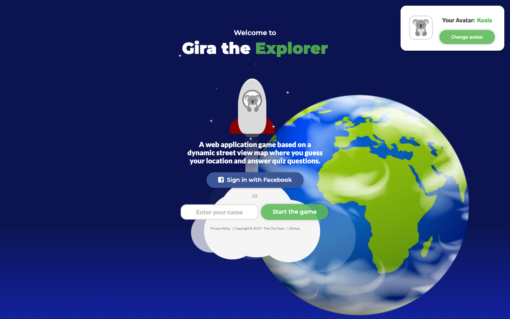
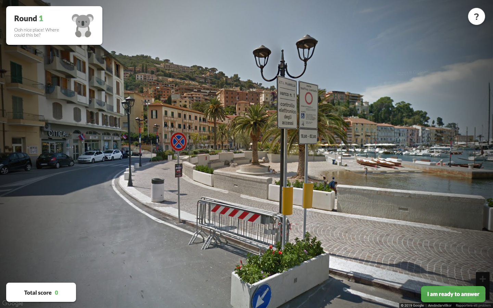
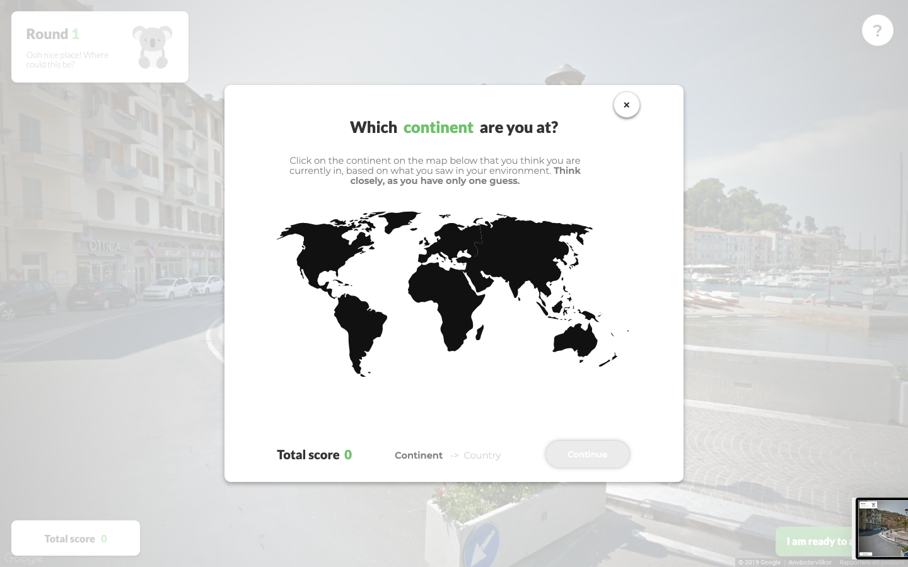
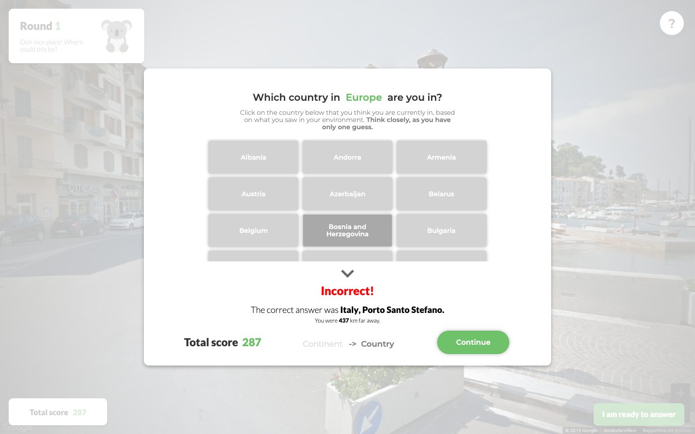
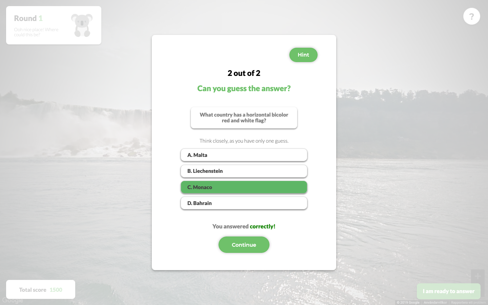

# Gira the Explorer

### Challenge your geography skills - guess where Gira dropped you and explore the world in street view. 

## Description
This is a web-based game that uses Google Maps API. The game consists of being dropped on a pseudo-random location in street view and by going around in street view mode the users have to guess where on earth they are. This is then followed by two quiz questions - based on your location.

### Background
This project was conducted during 4 sprints (à 5 days) for the course II1305 at KTH Royal Institute of Technology. The project group consisted of seven persons from the Degree Program in Information and Communication Technology (at KTH). 

## Visual demonstration

### Welcome screen

### Street view

### Modal for submitting continent

### Modal for submitting country

### Modal for quiz question

### Do you want to play? [Link](https://gira-the-explorer.netlify.com)

